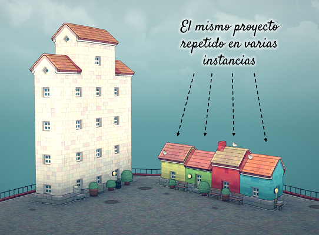
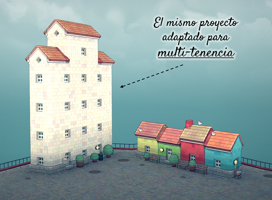
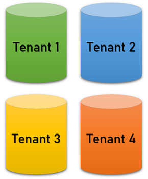
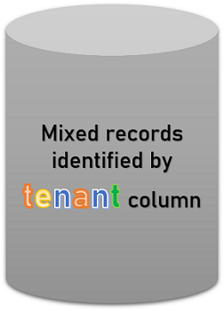
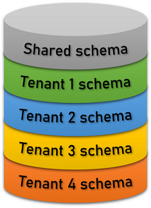
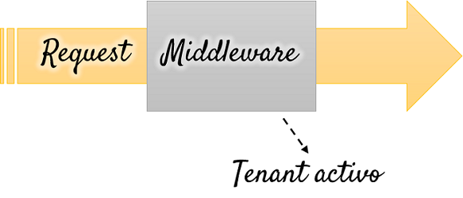

name: title
class: middle

.left-column-66[

# .high[El pony y la barbacoa]

]
.right-column-33[.right[]]

---

## 👋 Hola

.left-column-66[

#### Lorenzo Peña

-   Oriental de Holguín
-   Djangonauta hace 11 años
-   Fan de la pizza con atún (¿quién no?)

]
.right-column-33[]

---

layout: true

## El pony

---

---

.center[]

---

.center[]

---

.left-column-33[]

--

.right-column-66[.right[]]

---

layout: true

## La barbacoa

---

---

.left-column[]

--

.right-column[.right[]]

---

.left-column[]

--

.right-column[]

---

layout: false
class: center middle

# ¿Qué tiene que ver el pony con la barbacoa?

.left-column-33[]
.right-column-66[]

---

layout: true

## ¿Qué tiene que ver el pony con la barbacoa?

---

-   Viene un cliente .red[**rojo**] con un problema.

--

-   Tú desarrollas una solución en Django.

--

-   Justo después, vienen los clientes .blue[**azul**], .green[**verde**] y .yellow[**amarillo**] con el mismo problema.

--

.left-column-66[

## .right[🤔 ¿Qué hacer?]

]
.right-column-33[.right[]]

---

.center[]

---

.center[]

---

.center[]
.high[.center[Multi-tenancy 🤝 Barbacoas]]

---

.left-column-33[
.center[ Cuentas]
]

.left-column-33[
.center[ Espacios de trabajo]
]

.left-column-33[
.center[ Blogs]
]

.left-column-33[
.center[ Servidores]
]

.left-column-33[
.center[ Tiendas]
]

.left-column-33[
.center[ Sitios]
]

---

layout: false
class: middle center


---

layout: true

## El tenant activo

---

---

.left-column[.center[]]

--

.right-column[

```python
Question.objects.all()
```

]

--

<br/>

## .center[🤔 ¿Pero dónde?]

--

.left-column-33[.center[]]
.left-column-33[.center[]]
.left-column-33[.center[]]

---

.left-column[

-   Acceso a la base de datos
-   Revertir URL
-   El sitio Admin
-   Caché
    ]

.right-column[

-   Channels (websockets)
-   Management commands
-   Tareas de Celery
-   Almacenamiento de archivos
    ]

--

.warning[👀 Incluso fuera del ciclo request / response]

---

##### Dos preguntas interesantes:

--

.box[¿Cuál es el 🧪 **tipo** de un objeto tenant?]

--

.box[¿Qué pasa si en algún momento no hay 😶 **tenant activo**?]

---

class: middle
layout: false

# Tres decisiones de diseño

--

name: architectural-choices

1. Relación entre usuarios y tenants
2. Estructura de la base de datos
3. Ruteo de tenants

---

layout: true

## Relación entre usuarios y tenants

---

---

Los usuarios existen **fuera** del contexto de los tenants:

.left-column-66[
.left[]
]

--

.right-column-33[
.center[]
.center[]
.center[]
]

---

Los usuarios existen **dentro** del contexto de los tenants:

.left-column-66[
.left[]
]

--

.right-column-33[
.center[]
]

---

Los usuarios **son** los tenants:

.left-column-66[
.left[]
]

--

.right-column-33[
.center[]
.center[]
]

---

<br/>
<br/>
<br/>

## .center[🤔 ¿Cuál escoger?]

---

class: middle
layout: false

# Estructura de la base de datos

---

layout: true

## Estructura de la base de datos

.left-column[]
.right-column[{{content}}]

---

## Aislada

Una base de datos para cada tenant.

```python
Question.objects\
        .using(tenant1)\
        .all()
```

---

**Bueno**

-   Optimizada para separación de datos.

---

**Malo**

-   Sin relaciones entre bases de datos.
-   Agregar tenants implica reconfigurar el proyecto.

---

**Complicado**

-   Altos costos de operación.

---

layout: true

## Estructura de la base de datos

.left-column[]
.right-column[{{content}}]

---

## Compartida

Una sola base de datos con datos estan mezclados e identificados por tenant.

```python
Question.objects\
        .filter(tenant="tenant1")
```

---

**Bueno**

-   Optimizado para escalar.

---

**Malo**

-   Separar los datos debidamente requiere esfuerzo extra en el código.

---

**Complicado**

-   Es fácil olvidar la separación y comprometer los datos.

---

layout: true

## Estructura de la base de datos

.left-column[]
.right-column[{{content}}]

---

## Semi-aislada

Una sola base de datos, los tenants están separados por **schemas** de PostgreSQL.

```python
# SET search_path = tenant1
Question.objects.all()
```

---

**Bueno**

-   Optimizado para separación de datos, aunque con mayor escalabilidad.

---

**Malo**

-   La operación con schemas de Postgres tiene una mayor curva de aprendizaje.

---

**Complicado**

-   Migrar la base de datos se vuelve lento, muy lento.

---

layout: false

## Estructura de la base de datos

<br/>
<br/>
<br/>

## .center[🤔 ¿Cuál es la mejor opción?]

---

class: middle
layout: false

# Ruteo de tenants

---

layout: true

## Ruteo de tenants

---

name: activate-tenant

.box[🤔 ¿Cómo activar un tenant a partir de un request?]

--

.left-column-66[

##### En general

-   Inferido del usuario
-   Guardado en la sesión
-   Especificado en los headers
    ]

--

.right-column-33[

##### A partir de la URL

-   En el dominio
-   En el path
-   En el querystring
    ]

---

.box[🤔 ¿Cómo activar un tenant a partir de un request?]

<br/>

.center[]

---

.box[🙋‍♀️ ¿Cómo generar URLs canónicas a un tenant?]

<br/>

|     |                             |
| --- | --------------------------- |
| ❌  | Inferido del usuario        |
| ❌  | Guardado en la sesión       |
| ❌  | Especificado en los headers |

---

.box[🙋‍♀️ ¿Cómo generar URLs canónicas a un tenant?]

<br/>

|     |                   |                                        |
| --- | ----------------- | -------------------------------------- |
| ✔️  | En el dominio     | .emph[`tenant1`]`.example.com/view/`   |
| ✔️  | En el path        | `example.com/`.emph[`tenant1`]`/view/` |
| ✔️  | En el querystring | `example.com/view/?t=`.emph[`tenant1`] |

---

template: architectural-choices

---

class: middle
layout: false

# ¿Por qué es importante esto?

--

.center[]

---

class: middle
layout: false

# Y ahora, algunos paquetes

---

layout: true

## Paquetes que puedes usar

---

##### Base de datos compartida

-   [citusdata/django-multitenant](https://github.com/citusdata/django-multitenant)
-   [raphaelm/django-scopes](https://github.com/raphaelm/django-scopes)

##### Base de datos semi-aislada

-   [bernardopires/django-tenant-schemas](https://github.com/bernardopires/django-tenant-schemas)
-   [tomturner/django-tenants](https://github.com/tomturner/django-tenants)

.bottom[
.footnote[Otros paquetes en https://djangopackages.org/grids/g/multi-tenancy/]
]

---

layout: true

## Y se acabó

---

##### Puedes encontrarme aquí:

|         |                                                    |
| ------- | -------------------------------------------------- |
| Twitter | [@lorinkoz](https://twitter.com/lorinkoz)          |
| GitHub  | [github.com/lorinkoz](https://github.com/lorinkoz) |
| Correo  | [lorinkoz@gmail.com](mailto:lorinkoz@gmail.com)    |

.right[]

---

.left-column-66[]
.right-column-33[]

---

template: title
